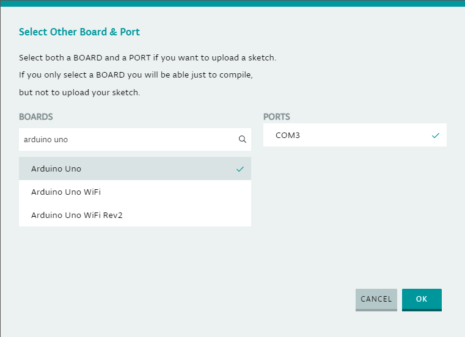

# Arduino Editor - IDE online

Além da IDE instalada no computador, é possível editar código Arduino e enviar para a placa através de um navegador, utilizando o [Arduino Editor](https://create.arduino.cc/editor). Ao acessar  o link, é apresentada uma página de login. É possível criar uma conta no site, ou se preferir, também pode-se fazer login com sua conta Google ou Apple.

Ao acessar o Editor pela primeira vez, o próprio site irá fazer um guia das principais features. Será necessário instalar um *Agent* para que o site possa fazer uso da porta USB em que a placa Arduino está conectada, neste link é possível acessar [instruções de como instalar o Agent](https://create.arduino.cc/getting-started/plugin/welcome). Após instalado, basta selecionar a porta e a placa no painel que se encontra acima do editor de texto

