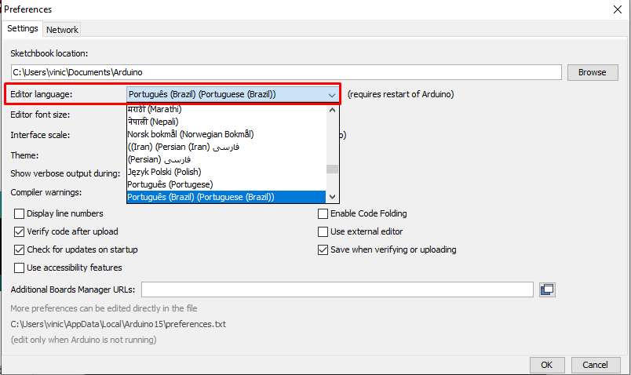

# IDE

O termo IDE vem de “Integrated Development Environment”, que em tradução livre significa “Ambiente de desenvolvimento Integrado”, é um software que reúne diversas ferramentas e automações para facilitar o desenvolvimento de softwares.

A IDE do Arduino é de fácil uso e instalação, disponível para plataformas Windows, Linux e macOS. É possível encontrar o download em [https://www.arduino.cc/en/software](https://www.arduino.cc/en/software). Também pode-se baixar em diversas lojas de aplicativos, como a Microsoft Store, para a plataforma Windows. A seção [Baixando e instalando a IDE](instalacao-ide.md) descreve um passo a passo de como fazer o download e a instalção na plataforma Windows.

## Interface básica
A interface da IDE é bem simples, com um menu de opções no topo, seguido por um cabeçalho que contém funções frequentemente usadas, como salvar, compilar, upload, entre outras que estão demonstradas na imagem abaixo.
Também há a área para a edição do código e logo abaixo, um terminal que dará informações de upload, compilação e possíveis erros caso haja falhas no processo. 

 
## Alterando o idioma da IDE
Caso deseje modificar o idioma do IDE, basta acessar o menu `File > Preferences` (ou digitar o atalho `CTRL` + `,` ) e na caixa `Editor Language` selecionar o idioma desejado. É necessário abrir novamente a IDE para as mudanças serem aplicadas.

