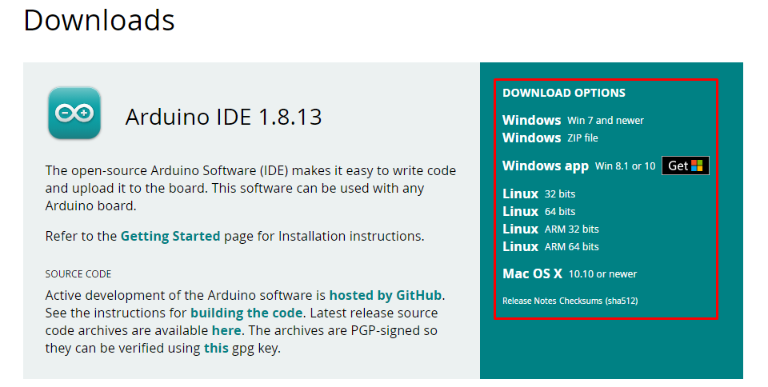
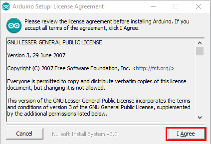
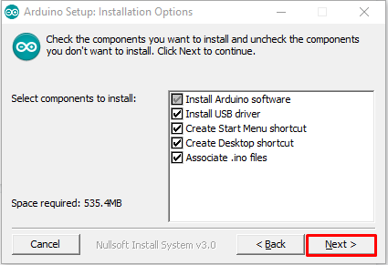
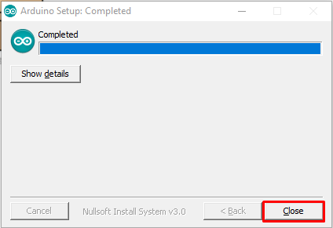

# Baixando e anstalando a IDE

O passo a passo a seguir foi feito em agosto de 2021, talvez haja modificações desde sua criação até a data em que você está lendo isso. Caso acredite ser pertinente uma mudança neste texto, informe através do email [pet@inf.ufrgs.br](pet@inf.ufrgs.br).  

Acesse a página [Arduino Software (IDE)](https://www.arduino.cc/en/software). Aqui é possível encontrar o download para as diversas plataformas que tem suporte à IDE. Escolha a que você está utilizando.

Como o projeto é open source, sua manutenção e desenvolvimento de novas funcionalidades depende de doações, caso seja de seu interesse contribuir financeiramente com o projeto, nem que seja com um pouco, pode fazer isso nesta tela. Caso não tenha condições ou não deseje contribuir, basta clicar no botão “JUST DOWNLOAD”.

## Instalação - Windows

Execute o arquivo _.exe_ baixado com permissões de Administrador. 
Leia e concorde com os termos de licenciamento.

Caso deseje uma instalação padrão (recomendado), apenas clique em “Next”.

Selecione a pasta de destino da instalação. Pode-se deixar como o padrão. Clique em “Install”.

Começará então o processo de instalação da IDE Arduino, o processo pode levar alguns minutos. Após, basta clicar em “close” e a instalação estará completa.

