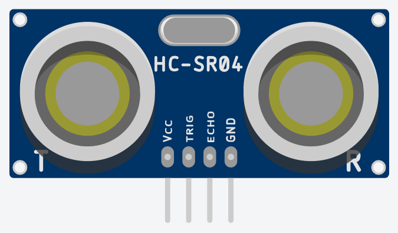
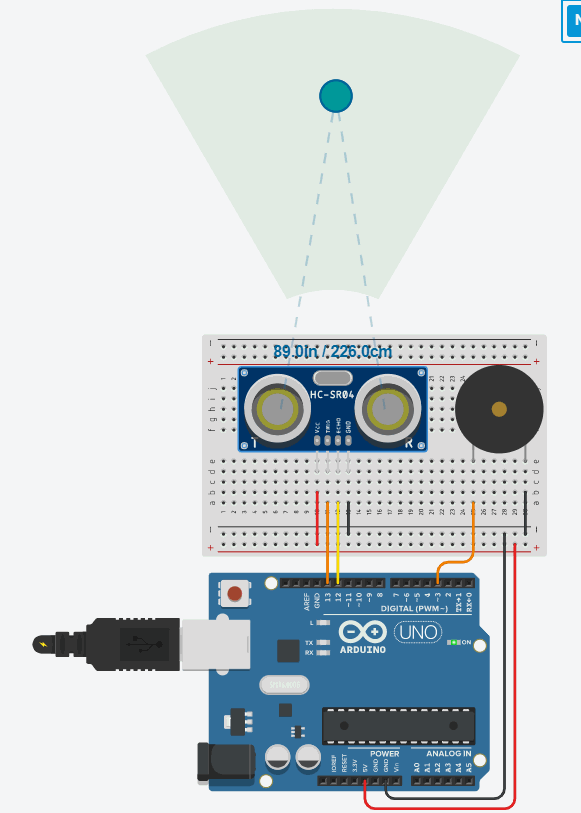

# Medindo distâncias com o sensor ultrassônico

O ouvido humano consegue identificar ondas de até aproximadamente 20 KHZ, frequências acima disso são chamadas de ultrassônicas e é com esse tipo de onda que o sensor opera. Quando acionado, são emitidos 8 pulsos de 40 KHz, então o sensor detecta se há algum sinal de retorno; caso seja identificado, é emitido no pino de saída um sinal de nível alto cujo tempo de duração é igual ao tempo calculado entre o envio e o retorno do sensor ultrassônico.

Por meio do tempo fornecido pelo sensor, é possível calcular a distância até o objeto/obstáculo, utilizando a equação:

Distância  = (`Tempo de duração do sinal de saída` × `velocidade do som`) / 2

Onde a `velocidade do som` pode ser considerada como __340 m/s__ (este valor é uma aproximação, pois a velocidade do som no ar depende de fatores como umidade e temperatura). Note que as unidades utilizadas no cálculo, pois para se obter um resultado consistente o `Tempo de duração do sinal de saída` deve estar em segundos, para assim se obter a distância em metros. Sem a divisão por `2`, o valor calculado corresponderia à distância que o pulso percorreu para chegar até o objeto/obstáculo somado com a distância de volta.

O sensor ultrassônico HC-SR04 possui 4 pinos. Normalmente eles são identificados na placa, conforme a imagem abaixo. O posicionado na extremidade direita (`GND`) deve ser conectado ao terminal GND, enquanto o da extremidade esquerda (`Vcc`) deve ser conectado ao terminal de 5V. O pino `TRIG` serve para controlar o envio dos pulsos ultrassônicos, enquanto que o pino `ECHO` retorna para o Arduino o tempo de duração entre o envio e a recepção do sinal. O sensor opera com distâncias de aproximadamente 2cm até 4m, com o ângulo de efeito sendo 15º



Neste projeto você montará um circuito onde um [buzzer](./../introducao/buzzer.md] irá tocar ao se aproximar a certa distância do sensor. Será utilizado um buzzer do tipo passivo, pois é o que o simulador do Tinkercad oferece, porém sinta-se à vontade para utilizar um buzzer ativo, o código irá sofrer uma pequena alteração, porém será explicitado onde fazê-la.

### Hardware
#### Materiais necessários:
- 1x Sensor ultrassônico HC-SR04
- 1x Buzzer passivo
#### Esquemático:


### Software

Para começar, é necessário declarar e inicializar algumas variáveis e constantes. Será utilizado o valor da velocidade do som em metros por microssegundos, pois é necessário manter a consistência de unidades nos cálculos, já que o sensor retorna o tempo em microssegundos. 

``` C
const int pinoTrigger = 13; // Pino usado para disparar os pulsos do sensor
const int pinoEcho = 12; // pino usado para ler a saida do sensor
const int pinoBuzzer = 3;

const float velocidadeSom = 0.000340; // Velocidade do som em metros por microssegundo
float tempoEcho;	// Tempo de resposta do sensor
float distancia;	// Distância do sensor ao objeto detectado
```

Após é necessário definir os modos e inicializar os pinos e iniciar o serial na função `setup()`. 
```C

void setup(){
  // Configura pino de Trigger como saída e inicializa com nível baixo
  pinMode(pinoTrigger, OUTPUT);
  digitalWrite(pinoTrigger, LOW);
  // Configura pino do buzzer como saída e inicializa com nível baixo
  pinMode(pinoBuzzer, OUTPUT);
  digitalWrite(pinoBuzzer, LOW);
  // configura pino ECHO como entrada
  pinMode(pinoEcho, INPUT);	
  // Inicializa a porta serial
  Serial.begin(9600);
}
```

Antes de escrever a função `loop()`, é preciso definir uma outra função, a qual será utilizada para ativar a emissão de ondas ultrassônicas pelo sensor. Isso é feito facilmente, controlando a ativação do pino *pinoTrigger*, basta colocá-lo em modo alto  e após alguns microssegundos voltar para o modo baixo.
```C
void disparaPulsoUltrassonico(){
  digitalWrite(pinoTrigger, HIGH);
  delayMicroseconds(10);
  digitalWrite(pinoTrigger, LOW);
  }
```

Na função `loop()` para ativar o sensor, deve-se utilizar a função 'disparaPulsoUltrassonico()`. Logo após é necessário capturar os dados gerados pelo sensor, isso pode ser feito através da função `pulseIn()`.

A função `pulseIn()` captura a duração de um pulso em um pino, é necessário passar dois parâmetros, são eles respectivamente:
*pino*: pino ao qual a leitura será realizada
*valor*: valor `HIGH` ou `LOW`, dependendo do tipo de leitura desejada.

Se o valor `HIGH` é passado para a função, a função pulseIn() espera o pino ir para do estado `LOW` para `HIGH`, começa a temporizar, e quando o pino retorna ao estado `LOW` o temporizador é parado. A função retorna o tamanho do pulso em microssegundos. O tempo de retorno será armazenado na variável `tempoEcho`.  

`tempoEcho = pulseIn(pinoEcho, HIGH);`

Agora com o tempo em mãos, é possível calcular a distância utilizando a fórmula dada anteriormente. Aqui também haverá uma multiplicação por *100*, para assim obter a distância em centímetros, o código ficará da seguinte maneira:

`distancia = ((tempoEcho*velocidadeSom_mporus)/2)*100;`

Agora, pode-se imprimir o resultado no Serial.

```C
  Serial.print("Distancia em centimetros: ");
  Serial.println(distancia);
```
Assim é possível ativar o buzzer quando o sensor lê uma certa distância. No código abaixo a frequência 784, que corresponde à nota *sol* irá tocar quando algo estiver a menos de 120 centímetros do sensor. Caso você esteja utilizando um buzzer ativo, basta substituir a função `tone()` por `digitalWrite(buzzer, HIGH);`

```C
  if(distancia <= 80)
    tone(buzzer, 784, 200); 
  else
    digitalWrite(buzzer, LOW);
  ```

Para finalizar a função `loop()`, um pequeno `delay()` apenas para não sobrecarregar demais o serial e ser possível uma leitura mais nítida.

```C
  delay(200);  
}
```

O código completo ficará da seguinte forma:

```C
const int pinTrigger = 13;              // Pino para disparar os pulsos do sensor
const int pinEcho = 12;                 // Pino para ler a saida do sensor
const int buzzer = 3;                   // Pino do buzzer

const float velocidadeSom = 0.000340;   // Velocidade do som, metros por microssegundo
float tempoEcho;                        // Tempo de resposta do sensor
float distancia;                        // Distância do sensor ao objeto detectado

void setup(){
  // Configura pino de Trigger como saída e inicializa com nível baixo
  pinMode(pinoTrigger, OUTPUT);
  digitalWrite(pinoTrigger, LOW);
  // Configura pino do buzzer como saída e inicializa com nível baixo
  pinMode(buzzer, OUTPUT);
  digitalWrite(buzzer, LOW);
  // configura pino ECHO como entrada
  pinMode(pinoEcho, INPUT);	
  // Inicializa a porta serial
  Serial.begin(9600);
}

void loop(){
  // Envia pulso para o disparar o sensor
  disparaPulsoUltrassonico();
  // Mede o tempo de duração do sinal no pino de leitura(us)
  tempoEcho = pulseIn(pinEcho, HIGH);
  distancia = ((tempoEcho*velocidadeSom_mporus)/2)*100;
  
  // Impressão no serial
  Serial.print("Distancia em centimetros: ");
  Serial.println(distancia);

  // Acionamento do buzzer
  if(distancia <= 120)
    tone(buzzer, 784, 200); 
  else
    digitalWrite(buzzer, LOW);
  
  delay(200);
}

// Funçao para enviar o pulso de trigger para o sensor ultrassônico
void disparaPulsoUltrassonico(){
  digitalWrite(pinTrigger, HIGH);
  delayMicroseconds(10);
  digitalWrite(pinTrigger, LOW);
  }
```

Para testar o projeto basta utilizar alguma fita métrica, colocando objetos a distâncias variadas do sensor e analisando se a medida física corresponde ao valor indicado no monitor serial. Note também que quando o objeto estiver a 120 centímetros ou menos, o buzzer deve começar a tocar.

Na plataforma Tinkercad, enquanto o projeto está sendo simulado, basta clicar no sensor ultrassônico e uma pequena interface irá se abrir. Nesta interface a área de funcionamento do sensor é destacada na cor azul, é possível posicionar um objeto nela e sua distância medindo tanto em polegadas quanto em centímetros)  aparecerá logo acima do sensor.




O Arduino aliado com esse sensor abre um leque de possibilidades para projetos interessantes, como sonares, robôs autônomos que detectam e mapeiam paredes de um ambiente, velocímetros e até mesmo automação para casa (usando como um detector de presença para ativar lâmpadas ou eletrodomésticos, por exemplo).
