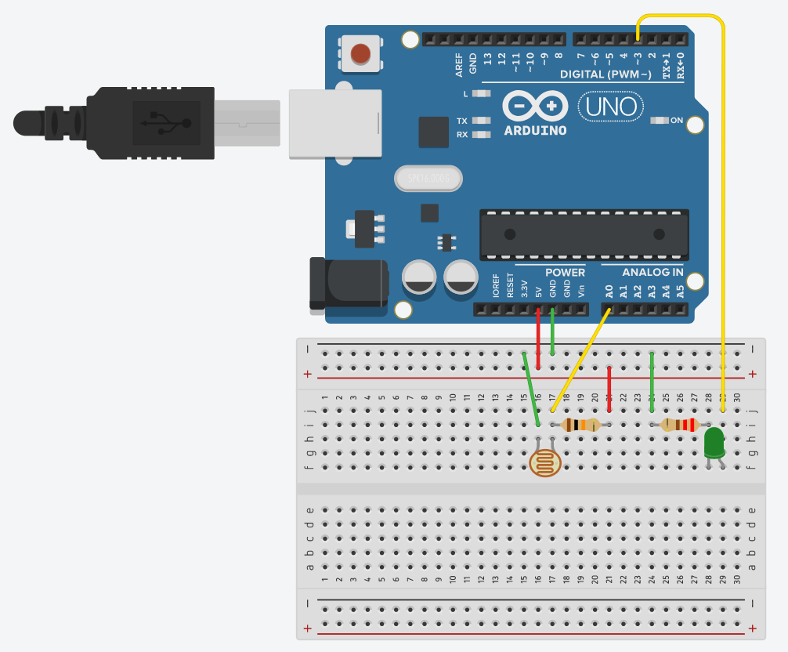
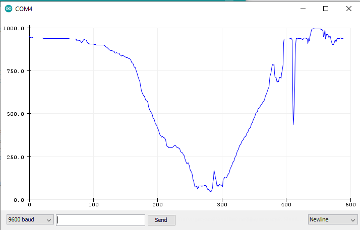

# Medindo a luminosidade do ambiente

Uma das funções mais poderosas do Arduino é a sua vasta gama de sensores e módulos disponíveis e sua fácil integração na hora de escrever um código. Imagine poder conectar sensores de temperatura e umidade para acionar um ar condicionado, ou um sensor de luminosidade para controlar o acionamento de uma lâmpada, ou quem sabe automatizar o funcionamento de eletrodomésticos.
Já pensou acordar e ter café prontinho lhe esperando? 
Melhor ainda, imagine tudo isso integrado e sendo controlado através de um celular ou de um computador! Tudo isso é possível com placas microcontroladoras, como o Arduino. 
Infelizmente, por agora a implementação destas funcionalidades foge do escopo deste curso, mas com os próximos projetos aqui demonstrados você terá uma base de conhecimento para começar a trabalhar com módulos e sensores. A partir daí, basta soltar sua criatividade e buscar mais referências externas! 

Este projeto, apesar de simples, terá como objetivo entender como funciona um sensor de luminosidade LDR e, com ele, implementar um programa que irá monitorar a luminosidade de um ambiente. Caso a luminosidade esteja abaixo de um certo valor, um LED acenderá (o LED serve como uma abstração, em uma aplicação prática você poderia conectar, no lugar do LED, um *módulo relé* e acionar uma lâmpada, por exemplo).

O LDR (*Light Dependent Resistor*, ou em tradução livre, Resistor Dependente de Luz) é um sensor que, como o próprio nome indica, se trata na verdade de um resistor que varia a sua resistência de acordo com a luminosidade incidida nele. Quanto mais luz, menor será a resistência, porém os valores específicos podem variar de acordo com condições do ambiente, fabricante do sensor e até mesmo o estado do circuito onde o resistor está inserido. 

A plataforma [Tinkercad](./../../introducao/tinkercad.md) é perfeita para fazer testes com sensores LDR, pois nela, além de ajustar a luz incidente no sensor em tempo de execução, é possível monitorar a corrente e a resistência produzidas pelo LDR. Basta colocar na área de trabalho um __Multímetro__ (coloque ele no modo __R__ para medir a resistência) e um __Fotossensor__ e conectar os terminais como na imagem abaixo. Após iniciada a simulação, é possível clicar sobre o Fotossensor e ajustar a luminosidade. É possível perceber a mudança no valor da resistência mostrado no multímetro, conforme o input de luminosidade é modificado.


Com o entendimento do sensor é possível partir para o projeto. Comece criando um novo sketch em sua IDE do Arduino. Primeiramente será necessário declarar em qual pino digital estará o LED e em qual pino analógico estará o sensor de luminosidade. Pela primeira vez os pinos analógicos aparecem em um projeto, eles tem uma resolução de 10 bits, ou seja, podem enviar/receber valores inteiros de 0 até 1023, tornando sua utilização com sensores perfeita, já que muitas vezes é necessário ter precisão e/ou uma larga faixa de trabalho (poderia-se usar também algum pino PWM, porém sua resolução é de apenas 8 bits (variação de 0 a 255)).

### Hardware

#### Materiais necessários:
+ 1x LED 
+ 1x Resistor de 330Ω
+ 1x Resistor de 10KΩ
+ Sensor de Luminosidade LDR

#### Esquemático:



## Software

Para começar, é necessário declarar alguns parâmetros, como os pinos utilizados (conforme configurado no momento da montagem do circuito) e uma variável para armazenar os dados lidos no sensor, que aqui é chamada de `luminosidade`, já inicializada com 0. Por fim, declare também um valor para o limite de luminosidade. Você deve ajustar esse valor conforme sua necessidade; aqui será utilizado *100*, pois é o valor que melhor se adapta no circuito montado na simulação do Tinkercad. Contudo ao utilizar em outros projetos e em outros meios, é necessário modificar esse valor, uma vez que os dados lidos dependem de fatores que vão desde o fabricante do chip até mesmo condições de temperatura e umidade do ambiente utilizado.

``` C
const int pinoLDR = A0;
const int pinoLED = 3;
int luminosidade = 0;
const int limiteLum = 100;
```
Na função `setup()` é necessário definir os pinos de entrada e saída, bem como iniciar o Monitor Serial. 

``` C
void setup() {
  pinMode(pinoLDR, INPUT); 
  pinMode(pinoLED, OUTPUT); 
  Serial.begin(9600); 
```
Na função `loop()` será feita a leitura do sensor utilizando a função `analogRead`; esse valor é armazenado na variável `luminosidade` utilizando a seguinte linha de código: `luminosidade = analogRead(pinoLDR);`. Agora, utilizando ` Serial.println(luminosidade);`, o valor lido pelo sensor será impresso no monitor serial e haverá uma quebra de linha em cada impressão. 
Também é possível fazer a checagem de valor; utilizando `if(luminosidade >= limiteLum)` para checar se o valor é maior que o limite definido anteriormente. Como você deve ter percebido, quanto mais luz incidindo sobre o sensor, menor será o valor retornado por ele. Logo, é checado quando o valor da luminosidade está acima do limite definido; se for o caso, significa que o ambiente está escuro, deve-se então utilizar a função `digitalWrite(pinoLED, HIGH);`para acender o LED. Caso contrário, o LED deve ser apagado; para isso, basta colocar o comando `digitalWrite(pinoLED, LOW);` dentro da condição `else`. 

O código completo ficará da seguinte maneira:

``` C
const int pinoLDR = A0;       // Pino analógico onde o sensor está conectado
const int pinoLED = 3;        // Pino digital onde o LED está conectado
const int limiteLum = 100;    // Valor limite de luminosidade para acender o LED
int luminosidade = 0;         // Valor lido pelo sensor LDR
 
void setup() {
  pinMode(pinoLDR, INPUT);    // Define o pino do sensor no modo de entrada
  pinMode(pinoLED, OUTPUT);   // Define o pino do LED no modo de saída
  digitalWrite(pinoLED, LOW); // Desliga o LED
  Serial.begin(9600);         // Inicia o serial
}

void loop() {
  luminosidade = analogRead(pinoLDR);   // Armazena na variável o valor lido pelo sensor
  Serial.println(luminosidade);         // Imprime o valor da luminosidade no serial
  if(luminosidade >= limiteLum){        // Caso a luminosidade seja maior que o limite
    digitalWrite(pinoLED, HIGH);        // O LED é ligado
  }
  else{ 
    digitalWrite(pinoLED, LOW);         // Caso contrário, o LED é desligado
  }
}

```

Opcionalmente, você pode adicionar a função de `delay()` logo após verificar/alterar o estado do LEDpara deixar o monitor mais legível. Além disso, a IDE do Arduino possui o Serial Plotter (acessível através do menu *Ferramentas* ou utilizando `Ctrl + Shift + L`), onde é apresentado um gráfico contendo a evolução das variáveis enviadas para o Serial. Abaixo encontra-se uma imagem com dados reais utilizando um sensor SDR enquanto uma fonte de luz se aproxima e se afasta do sensor.

