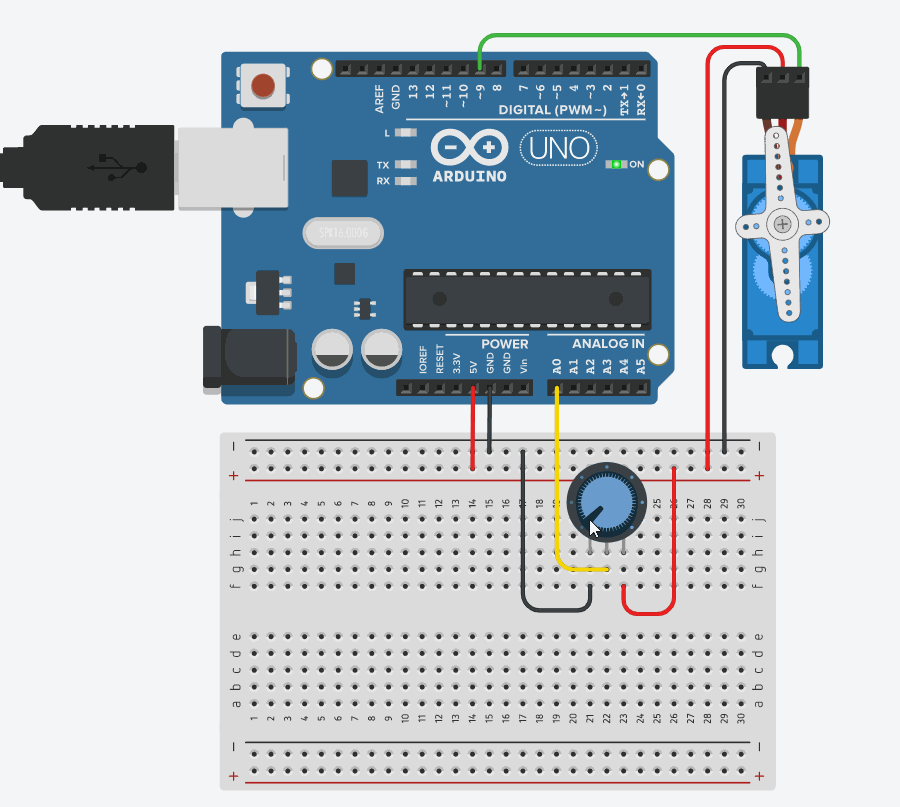

# Servo Motor

O servo motor é amplamente utilizado em projetos que necessitam do uso de um controle de movimento que exige posicionamento de alta precisão, reversão rápida e alto desempenho. Uma de suas características é a capacidade de se colocar em uma certa posição e manter-se nela, mesmo sofrendo com forças opostas. Sendo assim, é possível encontrá-lo em projetos de robótica, sistemas de radares, leitores de DVD, em brinquedos como carrinhos de controle remoto e na indústria, onde se torna um componente perfeito para automatização em linha de produção.

O Micro Servo motor SG90 é um dos servos mais populares para aplicações com Arduino. É possível comandar que o servo movimente seu eixo até determinado ângulo, podendo ir de -90º à 90º, ou seja, possui um grau de liberdade de 180º.

O servo motor possui três fios, sendo eles: 

+ Marrom: GND
+ Vermelho: VCC (com uma tensão de operação de 3v até 7,5V
+ Laranja: Controle PWM (fio que fará comunicação com o Arduino)


Note que os servos motores tendem a drenar uma quantidade considerável de energia, então, caso você precise utilizar mais de um ou dois motores simultaneamente, é recomendável utilizar uma fonte de energia externa para alimentá-los. 

O Arduino possui uma biblioteca que facilita o controle de um servo motor, a `Servo.h`. Ao utilizar a biblioteca, a função `analogWrite()` é desativada nos pinos digitais 9 e 10, ou seja, não é possível utilizar o PWM com esses pinos, pois eles serão reservados para o uso com os servos.

Alguns dos métodos mais utilizados são: 

| Função      | Descrição                                                                                                                                                      |
|-------------|----------------------------------------------------------------------------------------------------------------------------------------------------------------|
| `attach()`  | Equivale à função `pinMode()`, só que para os servos motores. Nela você passa como parâmetro o pino onde o terminal Sinal do servo está conectado ao Arduino. |
| `write()`   | Recebe como parâmetro um valor entre 0 e 180, que será definido como o ângulo do eixo do motor.                                                                 |
| `read()`    | Retorna o atual valor do ângulo do eixo do motor (o último valor passado através de uma função `write()`)                                                      |
| read()      | Retorna o primeiro byte de dados recebido disponível, ou -1 caso não haja nada disponível.                                                                      |
| readBytes() | Lê caracteres da porta serial e move-os para um buffer.                                                                                                         |
| write()     | Envia dados em formato binário para a porta serial.                                                                                                             |

Neste projeto, você conseguirá controlar a haste do motor através de um potenciômetro.

### Hardware
#### Materiais necessários
+ 1x potenciômetro de 10KΩ (a resistência não afetará o resultado deste projeto) 
+ 1x servo motor (preferencialmente o modelo SG90)

#### Esquemáticos


A montagem do circuito é bem simples, basta conectar a energia tanto no motor quanto no potenciômetro. Logo após, deve-se conectar o sinal do motor ao pino digital 9 do arduino e o pino central do potenciômetro ao pino analógico A0.

#### Software

O começo deste projeto é um pouco diferente: será necessário incluir a biblioteca do próprio arduino que contém os métodos do servo motor, para facilitar o uso do mesmo. Para isto, basta iniciar o código com a seguinte linha:

`#include “Servo.h”`

Com isso, pode-se então declarar e inicializar algumas variáveis. Aqui também será declarado um objeto do tipo `Servo`, que foi fornecido pela biblioteca *Servo.h*

```C
Servo servo;         // Inicializa o servo 
int angulo = 0;      // Ajusta o ângulo inicial do Servo
int pot = A0;         // Inicializa o pino analógico para o potenciômetro
```

Agora é possível definir o pino do potenciômetro como sendo de entrada e configurar a porta do servo motor, utilizando o método 'attach()':

```C 
void setup() { 
  servo.attach(9);            // Define que o servo está conectado a Porta 9
  pinMode(pot, INPUT) ; // Define o pino do potenciometro como entrada
} 
```

Na função `loop()` é tudo muito simples. Será utilizada a função `analogRead()` para ler na porta analógica. O valor retornado será um inteiro entre 0 e 1023, porém o ângulo que devemos passar para rotacionar o servo motor deve estar entre 0 e 180. Para esse fim é utilizada a função `map()`, convertendo a faixa de valores dados pela entrada do potenciômetro para a faixa de valores que será enviada para o motor.

```C
void loop() {
    angulo = analogRead(pot); 
    angulo = map(angulo, 0, 1023, 0, 180); 
```

Com o valor do ângulo, basta passá-lo para método `write()` e botar um pequeno delay.

```C
    servo.write(angulo); 
    delay(5);
} 
```

E é simples assim! Agora, basta rodar o código e notar que, ao girar o potenciômetro, a haste do motor irá girar também. Veja no gif abaixo:


